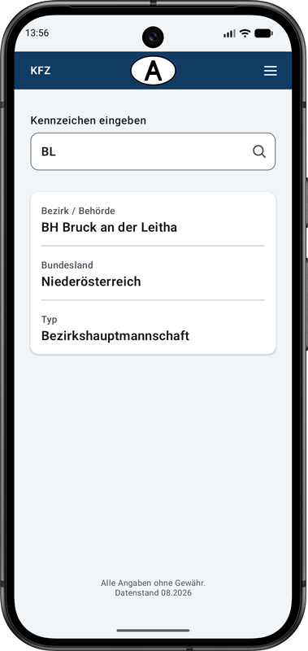

# KFZ-A

Offline Android app for looking up Austrian vehicle registration identifiers.

## Developer

HerkDev

## Screenshot

## Features

- Offline lookup of Austrian vehicle registration identifiers
- Geographical identifiers
- Government identifiers
- Diplomatic identifiers
- International organizations
- Material 3 user interface
- No advertising
- No tracking
- No Internet connection required

## Requirements

- Android 8.0 or newer
- Minimum SDK 26

## Data

Data status: 08.2026

Although great care has been taken, all information is provided without warranty.

## Privacy

KFZ-A works completely offline.

- No tracking
- No analytics
- No advertising
- No user accounts
- No Internet connection required

## Open Source

Licensed under the MIT License.

See also:

- LICENSE
- THIRD_PARTY_NOTICES.md
